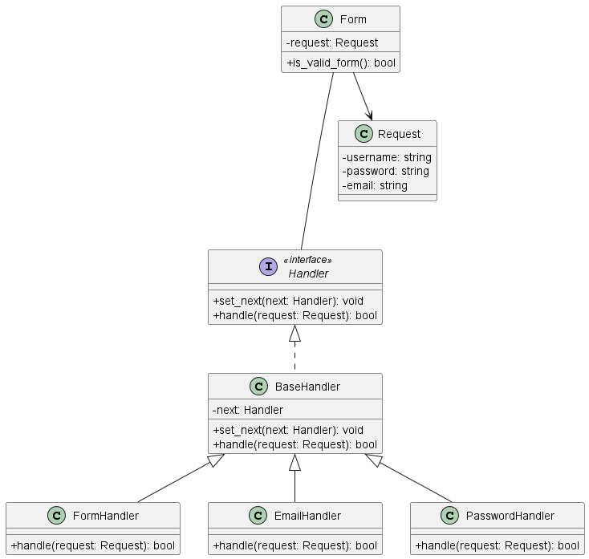

# Chain Of Responsibility

> Feito por **Gabriel Dos Santos Lima - 2115310010**

O **Chain of Responsibility** é um padrão de projeto
comportamental que permite que você passe pedidos por uma
corrente de handlers. Ao receber um pedido, cada handler
decide se processa o pedido ou o passa adiante para o próximo
handler na corrente.

> Fonte: Mergulho nos padrões de projeto, de Alexander Shvets

O código para implementação dos _handlers_ segue a seguinte estrutura:

Cada _handler_ deve, ou processar a _request_ ou passar a mensagem adiante formando uma cadeia de
tratativas.

## Exemplo: Validação de formulário

Para a entrega de um sistema que garanta a segurança e integridade dos dados informados pelo usuário, é necessário implementar uma série de validações durante seu cadastro como validação de e-mail, senha e campos do formulário no geral. Para este exemplo, temos a validação de um formulário em três etapas:

1. Validação de campos vazios
2. Validação de e-mail
3. Validação de senha

