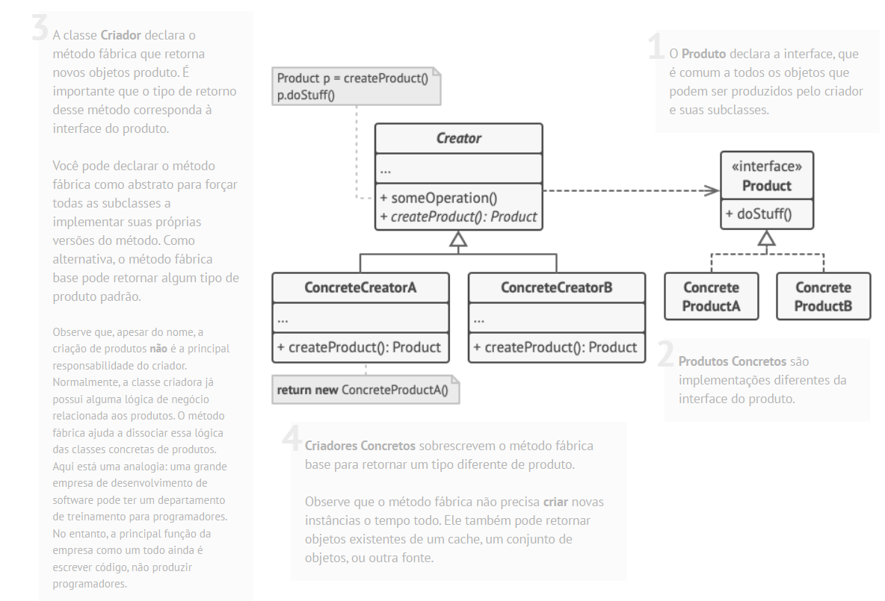
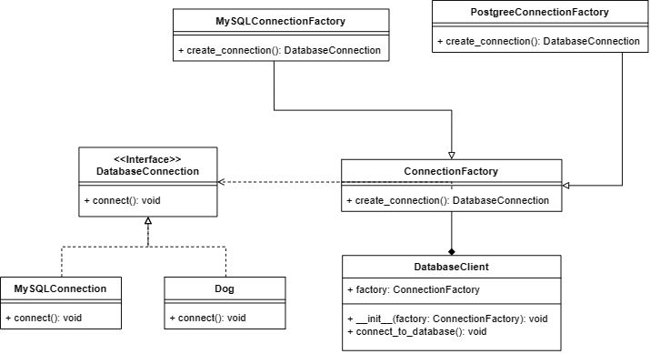

# Factory Method

O **Factory Method** é um padrão de projeto
criacional que fornece uma interface para criar objetos em uma superclasse, mas permite que as subclasses alterem o tipo de objetos que são criados.

Uma arquitetura que implementa o Factory Method, possui uma de suas partes com uma estrutura de classes semelhante a descrita abaixo:



Como exemplo, no arquivo ```animal_example.py``` são implementadas classes utilizando o padrão de projeto FactoryMethod para instanciar tipos diferentes de animais com métodos e atributos em comum. Conforme o diagrama de classes ilustrado abaixo, podemos perceber que a estrutura de classes implementadas é igual a ilustrada no diagrama acima.


Obs: a classe ```AnimalClient``` é a representação genérica de uma classe de negócios que, sem o AnimalFactory, precisaria instanciar os tipos de Animal diretamente.


Outro exemplo implementado, que mostra ilustra o padrão estrutural do FactoryMethod, está contido no arquivo ```database_example.py```, em que são implementadas classes para lidar com diferentes conexões de Banco de Dados. E, conforme ilustrado abaixo, também se assemelha muito a estrutura padrão do FactoryMethod:




> Melinne Diniz de Oliveira - 2115310021


